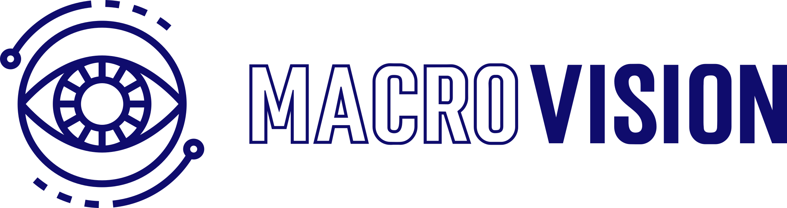

# MacroVision App

O **MacroVision** é uma aplicação web desenvolvida para realizar análises dimensionais de peças anatômicas utilizando visão computacional, destinado à médicos patologistas. A aplicação consiste em um frontend construído com React e um backend em Python usando Flask. Ela permite conectar câmeras, capturar imagens, realizar medições automáticas, salvar os resultados e gerenciar relatórios.

## Equipe de Desenvolvimento

Caio Alexandre dos Santos - RM: 558460 <br>
Italo Caliari Silva - RM: 554758<br>
Leandro do Nascimento Souza - RM: 558893<br>
Rafael de Mônaco Maniezo - RM: 556079<br>
Vinicius Rozas Pannuci de Paula Cont - RM: 555338<br>

> **Engenharia de Software - FIAP** <br>
> **Challenge 2025 - DASA**

## Tecnologias Utilizadas

* **Frontend:**
    * React (v19.2.0)
    * Vite
    * Supabase Client (`@supabase/supabase-js`)
* **Backend:**
    * Python
    * Flask
    * OpenCV (`opencv-python`)
    * Boto3 (AWS SDK for Python)
    * Flask-CORS
    * NumPy
    * python-dotenv
* **Banco de Dados:** Supabase
* **Armazenamento de Imagens:** AWS S3

## Estrutura do Projeto
```bash
├── backend/   # Código do servidor Flask (Python)  
│   ├── app.py   # Arquivo principal da API Flask 
│   ├── camera_service.py   # Lógica para detecção e teste de câmeras 
│   ├── measurement_service.py   # Lógica para análise dimensional 
│   ├── s3_service.py   # Serviço para interagir com AWS S3 
│   ├── requirements.txt   # Dependências Python 
│   └── README.md   # README específico do backend 
├── public/   # Arquivos estáticos (ícone, etc.) 
├── src/   # Código fonte do frontend (React) 
│   ├── assets/   # Imagens e logos 
│   ├── components/   # Componentes React (Dashboard, Login, Análise, etc.) 
│   ├── services/   # Módulos para API e Supabase 
│   ├── styles/   # Arquivos CSS 
│   ├── App.jsx   # Componente raiz da aplicação React 
│   ├── index.css   # Estilos globais 
│   └── main.jsx   # Ponto de entrada do React 
├── .gitignore   # Arquivos e pastas ignorados pelo Git 
├── eslint.config.js   # Configuração do ESLint 
├── index.html   # HTML principal 
├── LICENSE   # Licença do projeto (MIT) 
├── package.json   # Dependências e scripts do Node.js 
├── package-lock.json   # Lockfile do npm 
└── vite.config.js   # Configuração do Vite
```

## Instalação e Configuração

### Pré-requisitos

* Node.js e npm (ou yarn)
* Python e pip
* Conta na AWS com um bucket S3 configurado
* Projeto no Supabase configurado

### 1. Clonar o Repositório

```bash
git clone <url_do_repositorio>
cd app_macrovision
```

### 2. Configurar o Backend
Consulte o arquivo backend/README.md para instruções detalhadas sobre como configurar e executar o backend. Os passos principais são:

- Navegar para a pasta backend.

- Criar e ativar um ambiente virtual Python (venv).

- Instalar as dependências Python: pip install -r requirements.txt.

- Criar um arquivo .env na pasta backend/ com as credenciais da AWS (Access Key, Secret Key, Region, Bucket Name).

### 3. Configurar o Frontend
- Na raiz do projeto, crie um arquivo .env.local.

- Adicione as seguintes variáveis de ambiente com suas credenciais do Supabase:

```bash
VITE_SUPABASE_URL=sua_url_do_supabase
VITE_SUPABASE_ANON_KEY=sua_anon_key_do_supabase
```

- Instale as dependências Node.js:

```bash
npm install
# ou
yarn install
```

## Executando o Projeto
### 1. Iniciar o Backend
Certifique-se de que o ambiente virtual Python esteja ativado.

Na pasta backend/, execute:

```Bash
python app.py
```

O servidor backend estará rodando em http://localhost:5000.

### 2. Iniciar o Frontend
Na pasta raiz do projeto, execute:

```Bash
npm run dev
# ou
yarn dev
```

A aplicação frontend estará acessível geralmente em http://localhost:5173 (verifique a saída do terminal do Vite).

## Funcionalidades Principais
- Login: Autenticação de usuários (Médico/Administrador).

- Dashboard: Visão geral e acesso rápido às funcionalidades.

- Nova Análise:

    - Seleção e teste de câmeras conectadas.

    - Captura de imagens e análise dimensional automática usando OpenCV.

    - Registro de informações do médico, paciente e detalhes da análise.

    - Upload das imagens capturadas para o AWS S3.

    - Salvamento dos dados da análise no Supabase.

- Relatórios:

    - Listagem e visualização detalhada das análises salvas.

    - Filtros por data, paciente e tipo de análise.

    - Exclusão de análises.

    - (Futuro) Edição e exportação para PDF.

## API Endpoints (Backend)
O backend expõe uma API REST para o frontend consumir. Os principais endpoints incluem:

```
/api/status: Verifica o status do servidor.

/api/cameras: Lista câmeras disponíveis.

/api/cameras/<id>/test: Testa a conexão com uma câmera específica.

/api/analyze: Realiza a análise dimensional.

/api/images: Lista imagens no S3.

/api/images/<s3_key>: Deleta uma imagem específica do S3.

/api/images/clear: Deleta todas as imagens do S3.

/api/images/presigned/<s3_key>: Gera uma URL assinada para acesso temporário à imagem.
```

(Consulte backend/README.md para mais detalhes sobre a API).

Licença
Este projeto está licenciado sob a Licença MIT. Veja o arquivo LICENSE para mais detalhes.